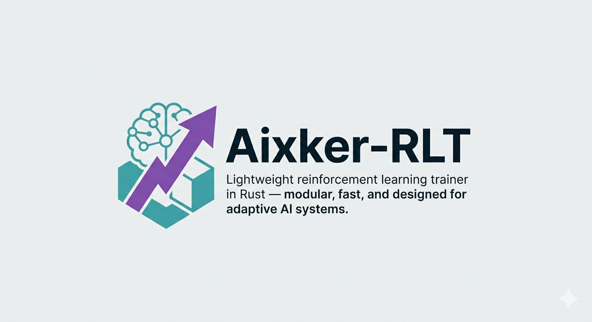

# Aixker-RLT
Lightweight reinforcement learning trainer in Rust — modular, fast, and designed for adaptive AI systems. Part of the AIXKER ecosystem.




## Overview
Aixker-RLT (AIXKER Reinforcement Learning Trainer) is a minimal, modular, and production-ready framework for training and evaluating reinforcement learning (RL) models — designed to be embedded [...]

It’s part of the **AIXKER ecosystem**, an initiative to bring **AI-native intelligence** into modern infrastructure — but AIXKER-RLT can also be used as a **standalone RL framework** in any pr[...]

---

## 🚀 Features

- ⚡ **Lightweight Core** — Simple modular design with minimal dependencies.  
- 🧩 **Customizable Inputs/Outputs** — Accept any number of parameters for flexible training.  
- 🔁 **Continuous Learning** — Supports online and on-device adaptation in production.  
- 🧠 **Multi-Agent Ready** — Built to scale across multiple agents or nodes.  
- 📊 **Logging & Metrics Hooks** — Integrates easily with external metric collectors.  

---

## Installation

```bash
# Clone the repository
git clone https://github.com/ali-heidari/aixker-rlt.git
cd aixker-rlt

# Build the project using Cargo
cargo build --release
```

---

## 🧬 Example Usage

```rust
// Example pseudo-code (Rust-like)
use aixker_rlt::Trainer;

#[tokio::main]
async fn main() -> Result<()> {
    env_logger::init();
    let state = Arc::new(Mutex::new(SyntheticState::new()));
    let cloned_state = Arc::clone(&state);

    aixker_rlt::initialize(load_config().unwrap());

    Node::start(
        move |lowest_state| get_features(&mut cloned_state.lock().unwrap(), lowest_state),
        |x, y| compute_reward_with_success(x, y as u8),
        CONFIG.get().unwrap().mode,
    )
    .await;

    Ok(())
}
```

---

## Configuration

* **Inputs:** Any numeric parameters representing the system/environment state
* **Outputs:** Actions or decisions produced by the RL model
* **Logging:** Supports integration with external metric collectors (Falcon Metrics, Prometheus, etc.)

---

## Roadmap

* [x] Dynamic hyperparameter tuning
* [x] Improved sample efficiency for online learning
* [x] CLI for model training and exporting
* [x] Integration with AIXKER Metrics Collector
* [x] Release first stable API
* [ ] Define inputs

---

## Contributing

We welcome contributions!

1. Fork the repository
2. Submit pull requests for bug fixes or features
3. Open issues for bugs, discussions, or proposals

Please follow the [Rust community style guide](https://doc.rust-lang.org/1.0.0/style/) and add tests for new functionality.

---

## License

AIXKER-RLT is released under the **Apache 2.0 License**.
© 2026 Ali — part of the [AIXKER Project](https://github.com/AIXKER).

> Commercial licensing available through AIXKER for enterprise integration.

---

## Documentation

This repository includes a `docs/` folder containing readable Markdown documentation and an `index.md` landing page.

## Standards

This project follows the `ai-agent-standards` conventions. The main AI agent guidance is documented in `.github/copilot-instructions.md`, and shared standard files are available at:

- `https://github.com/ali-heidari/ai-agent-standards`

## Related Projects / Ecosystem

* **[Aixker Agent](https://github.com/Aixker/aixker-agent)** — AI-native node agent using Aixker-RLT
* **[RLT-CLI](https://github.com/ali-heidari/RLT-CLI)** — Command-line interface (CLI) for Aixker-RLT

---

## Contact / Community

* GitHub: [ali-heidari](https://github.com/ali-heidari)
* Email: [ali-heidaril@outlook.com](mailto:ali-heidari@outlook.com)
* AIXKER: [https://github.com/AIXKER](https://github.com/AIXKER)

